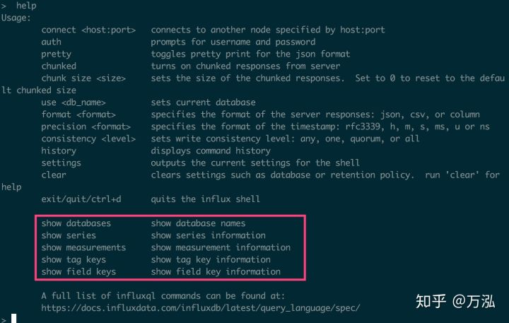
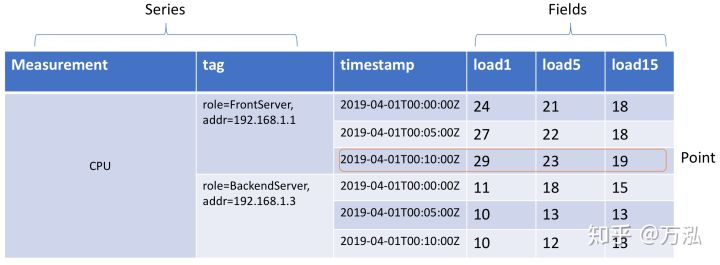

# InfluxDB: 安装、使用与模型介绍（一）

## 前言

近几年在时序数据库的场景下，InfluxDB快速崛起，InfluxDB针对于时序数据的特点，针对性的做了许多优化，比如为了保证高效的数据写入，设计和开发了TSM（类似于LSM）。同时使用Go作为开发语言，天然的跨平台。简单易用的SDK。种种原因使InfluxDB在广大开发者中流行起来。因此我们也从最简单的安装部署一步一步的带领大家认识InfluxDB。

## 安装

先把发布包下载并安装起来，实践才是最好的学习途径

```
# 下载
wget https://dl.influxdata.com/influxdb/releases/influxdb-1.7.5.x86_64.rpm
yum localinstall influxdb-1.7.5.x86_64.rpm -y

# 启动
/bin/systemctl start influxdb.service
```

## 命令行使用

```
influx
```

如图


DB成功部署之后，我们已经成功了一大半。为了让大家能很快上手操作，InfluxDB的几大核心概念有必要让大家先了解一下，否则无从下手。

## 模型和基本概念

从influx help中，我们会看到5个基本的概念，依次为databases、series、measurements、tag keys和field keys：



Database：数据库，简单类比Mysql的数据库概念，和一些云服务的实例概念一致。这个是管理概念，管理细节。就不单独细说，我们主要关注InfluxDB中的如下核心的逻辑概念：Series、Measurement、Tag、Timestamp、Fields、Point。

首先，我们先看一张InfluxDB定义的模型图，便于大家快速理解一下的这几个概念，我们以实际的Linux服务CPU指标存储为例：



- Series: 时序模型的时间线概念，Measurement + Tag唯一确认一条时间线。比如图3，存储了两条时间线，分别是：

```
时间线1 ：CPU，groups=FrontServer|addr=192.168.1.1
时间线2：CPU，groups=BackendServer|addr=192.168.1.2
```

像内存、Disk Util等等，我们都可以作为几条新的时间线。

- Measurement（Metric）：中文直译为“度量”，但是直译的中文并不能很好的反应该字段的作用，简单理解为“Metric|指标”更清晰。按照上面模型的定义，CPU、内存、Disk Util、网络等，都可以作为一个指标。
Tag：标签，详细描述一条时间线属性。比如图3，我们可以在Tag中添加跟多的属性，比如CPU型号、核数、频率等。
- Timestamp：时间戳，描述当前时间线时间发生的具体时间点。
- Fields：时间线的值，由一列或者多列组成。
- Point：Timestamp + Felids构成一个Point，描述在一个时间点发生的具体事件。

上面的核心概念我们必须反复理解，可以尝试自己在记事本上重放以上概念和模型，因为InfluxDB整个设计就是基于以上模型，真正理解模型之后，后续的接口调用、场景设计就非常简单了。

## 简单使用

我们还是以CPU的指标为例，我们先本地准备几条样例数据，按照以上模型，将数据导入到DB当中。

```
# 先创建一个DataBase
CREATE DATABASE monitor;
use monitor;

# 写入上图中的数据（系统会自动创建Measurement）
# 写入第一条时间线数据
INSERT CPU,role=FrontServer,addr=192.168.1.1 load1=24,load5=21,load15=18 1554076800
INSERT CPU,role=FrontServer,addr=192.168.1.1 load1=27,load5=22,load15=18 1554077100
INSERT CPU,role=FrontServer,addr=192.168.1.1 load1=29,load5=23,load15=19 1554077400

# 写入第二条时间线数据
INSERT CPU,role=BackendServer,addr=192.168.1.3 load1=11,load5=18,load15=15 1554076800
INSERT CPU,role=BackendServer,addr=192.168.1.3 load1=10,load5=13,load15=13 1554077100
INSERT CPU,role=BackendServer,addr=192.168.1.3 load1=10,load5=12,load15=13 1554077400
```

查看Series、Measurement、Tag keys和Felid keys

```
# 显示时间线
show series 

# 显示度量
show measurements

# 显示Tag的Key
show tag keys

# 显示数据字段的Key
show field keys
```

## 查看数据

样例

```
# 查看自定度量的数据, 里面的相关字段，官方建议使用“双引号”标注出来
select * from "CPU" order by time desc

# 查看指定的Field和Tag
select "load1","role" from "CPU" order by time desc

# 只查看Field
select *::field from "CPU" 

# 执行基本的运算
select ("load1" * 2) + 0.5 from "CPU"

# 查询指定Tag的数据，注意，Where子句的字符串值要使用“单引号”，字符串值
# 如果没有使用引号或者使用了双引号，都不会有任何值的返回
select * from "CPU" where role = 'FrontServer'

# 查询Field中，load1 > 20 的所有数据
select * from "CPU" where "load1" > 20
```

OK, 今天我们初步对InfluxDB有一个初步的了解，后面我们继续讲解InfluxDB的高级功能。

## 引用

- [InfluxData (InfluxDB) | Time Series Database Monitoring & Analytics](https://link.zhihu.com/?target=https%3A//www.influxdata.com/)
- [Influx Query Language (InfluxQL) reference](https://link.zhihu.com/?target=https%3A//docs.influxdata.com/influxdb/v1.7/query_language/spec/)

